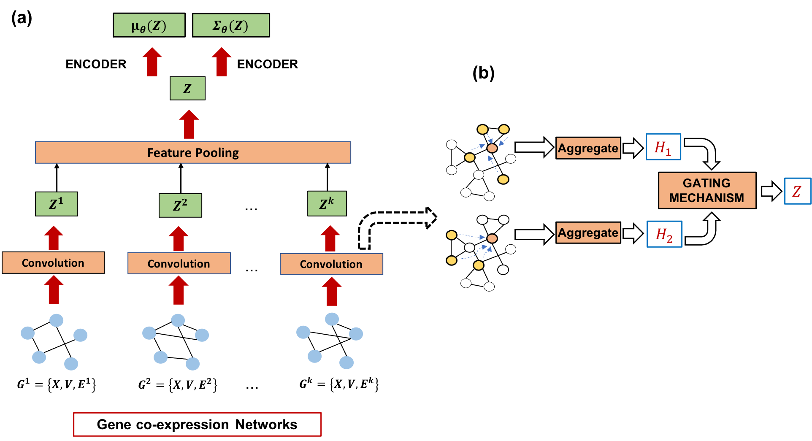

# gene2gauss: A multi-view gaussian gene embedding learner for analyzing transcriptomic networks
<br/>
<p align="center"></p>

This repository contains the code for the algorithm <i>gene2gauss</i>, part of a manuscript submission for AMIA 2022 Informatics Summit.

## Requirements
 * <a href="https://www.tensorflow.org/install">TensorFlow 2</a>
 * numpy (>=1.18.1), pandas (>=1.0.3), scikit-learn (>=0.22.1)
 * scipy (>=1.4.1) for sparse implementation
 * matplotlib (>=3.1.3) for generating visualizations

&nbsp;&nbsp;All requirements are listed in <b>requirements.txt</b> and can be installed together
```bash
pip install -r requirements.txt
```

## Training
Our model can be trained in either supervised or unsupervised approaches.
```bash
python training_supervised.py (or) training_supervised.py 
      --inpath /path to input networks/
      --feat_file /path to matrix(.npy) containing node features/
      --sparse
      --val_file /path to file containing validation edges/ 
      --hid_dims 128
      --outpath /outdir/
```
 